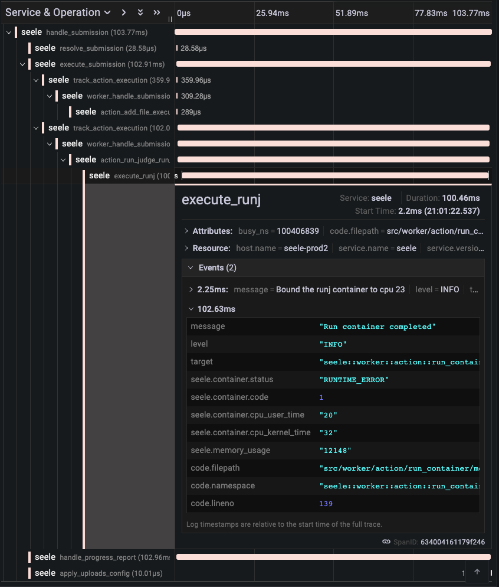

<p align="center"></p>
<h1 align="center">
  Seele
  <br>
  
  
  
</h1>

<p align="center">
  <b><a target="_blank" href="https://github.com/darkyzhou/seele/blob/main/README.en.md">[View in English]</a></b>
  &nbsp;
  <b><a target="_blank" href="https://seele.darkyzhou.net/en">[English Docs]</a></b>
  &nbsp;
  <b><a target="_blank" href="https://seele.darkyzhou.net/">[中文文档]</a></b>
</p>

Seele is a cloud-native online judge system, mainly targeting computer-related online course systems, programming competitions, and other scenarios. It serves as a judging service to receive user-submitted code, run it in a sandbox, and return judge reports.

The birth of Seele was to address the shortcomings of some popular open-source online judge systems in terms of scalability, extensibility, and observability. At the same time, its sandbox is based on the famous container runtime runc and uses [Rootless Containers](https://rootlesscontaine.rs/) to bring additional security. Currently, Seele serves the online course system of a university in South China, undertaking various experimental courses and machine test requirements, covering thousands of teachers and students from different colleges.

This project is the author's undergraduate graduation design and is in the early stages. There may be many shortcomings in terms of functionality and stability, so please bear with us. If you have any suggestions or find any bugs, please feel free to submit an issue and leave a star.

## Scalability

From the very beginning of its design, Seele has fully considered the importance of utilizing multiple CPU cores provided by the system to improve parallel processing capabilities for requests.

In addition, Seele can run in various environments. It can be run directly as a regular user on the system or scheduled with multiple instances using platforms like Docker and Kubernetes to handle user requests. When running on the Kubernetes platform, users can automatically scale horizontally based on system load, making full use of computing resources provided by multiple servers.

## Extensibility

Seele allows users to use YAML to describe the specific content of each step of the judge task in a structure similar to GitHub Actions and determine the dependencies, concurrency relationships, etc., between each step. To run any program, users only need to provide the corresponding container image names. Seele will automatically install these images and then start containers to run the specified programs.

Following is a simple judge task, divided into three steps: adding source files, compiling source files, and executing programs. This judge task also provides a snippet of JavaScript code. When the judge task is executed, Seele will run this code to attach additional content to the returned judge report.

In this way, Seele delegates the responsibility for defining the judge process to the user, allowing them to freely customize the judge process to cope with complex and changing course requirements.

```yaml
reporter:
  # Seele offers a global variable `DATA` representing the report object
  javascript: |
    const date = new Date();
    return {
      report: {
        message: "Hello at " + date;
        type: DATA.steps.prepare.status;
      }
    }

steps:
  prepare:
    action: "seele/add-file@1"
    files:
      # Add a file named `main.c` using the following content
      # You can also provide the content using http url
      - path: "main.c"
        plain: |
          #include <stdio.h>
          int main(void) {
            printf("Hello, world!\n");
            return 0;
          }

  compile:
    action: "seele/run-judge/compile@1"
    # Use the official gcc image from Docker Hub
    image: "gcc:11-bullseye"
    command: "gcc -O2 -Wall main.c -o main"
    sources: ["main.c"]
    saves: ["main"]

  run:
    action: "seele/run-judge/run@1"
    image: "gcc:11-bullseye"
    command: "main"
    files: ["main"]
```

## Observability

Seele provides good observability based on [OpenTelemetry](https://opentelemetry.io/), making it easy for maintainers to understand the current load of the judge system and set up related alerts. It mainly provides Tracing and Metrics indicators. Tracing can track the execution process of each input judge task in various components of the judge system. Metrics can provide information on the load of the judge system and the speed of processing requests.

The following image shows an example of monitoring Metrics indicators using [Grafana](https://grafana.com/).


The following image shows Tracing data for a judge task collected and displayed by [Tempo](https://grafana.com/oss/tempo/).



## Security

Seele's sandbox is based on container technology provided by the Linux kernel, including [Control Group v2](https://www.kernel.org/doc/html/latest/admin-guide/cgroup-v2.html) and [Namespaces](https://www.kernel.org/doc/html/latest/admin-guide/namespaces/index.html). It also uses [Rootless Containers](https://rootlesscontaine.rs/), so it does **not** require `root` privileges. Compared to many sandboxes based on `ptrace`, it has better security, scalability, and does not significantly impact program execution efficiency. Compared to many sandboxes based on `seccomp`, it has better flexibility and does not require system call whitelists for each judge scenario.

The underlying sandbox is based on the famous container runtime [runc](https://github.com/opencontainers/runc/), allowing the sandbox to continuously provide fixes for security vulnerabilities appearing in the Linux kernel alongside updates, ensuring the correctness of container technology usage. We have prepared dozens of test cases for Seele's sandbox integration test, coming from [Qingdao University's judge system](https://github.com/QingdaoU/Judger), [Vijos](https://github.com/vijos/malicious-code), and [Matrix course system](https://matrix.sysu.edu.cn/about), covering malicious behaviors such as consuming computing resources and outputting large amounts of data. The results show that the sandbox can pass these test cases and protect system security.

## Missing Features

Seele is a relatively pure judge system with only one function: to receive externally submitted judge tasks, execute them, and return judge reports. It **does not have** other features that many other judge systems often possess, such as user management, course management, competition features, leaderboards, and web management frontends.

Seele does not have the ability to save judge tasks. When the system is shut down or crashes during the judge task execution, it will not re-execute the judge tasks. Therefore, users need to maintain their own mechanism for saving and tracking submitted judge tasks.

## Online Documentation

For more information, please visit the online documentation: [https://seele.darkyzhou.net](https://seele.darkyzhou.net)
